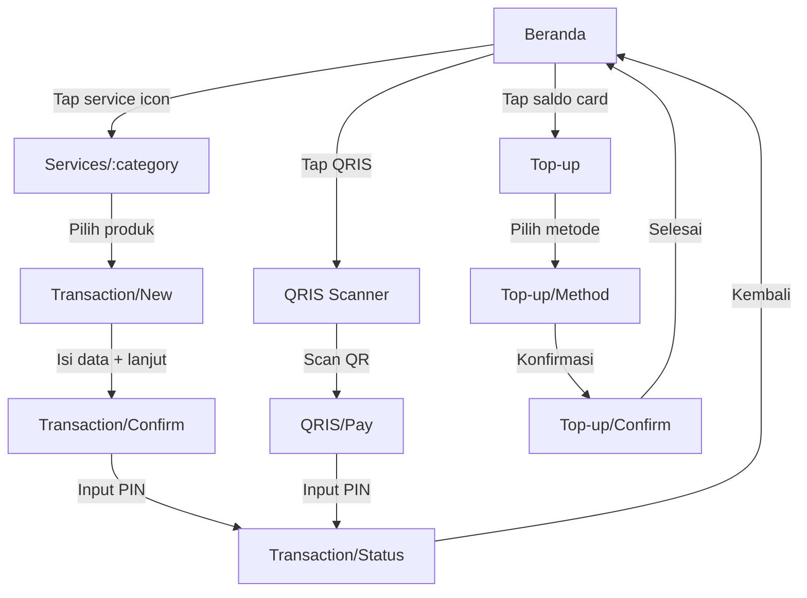

# MahaCell – Frontend Implementation Plan (v2)

Aplikasi pembayaran digital (PPOB) mobile-first PWA dengan React + Vite. Terinspirasi dari desain uPulsa dengan sentuhan premium. Mencakup fitur **QRIS scanner** dan dukungan **dark/light mode**.

## Visual Reference

````carousel

<!-- slide -->

<!-- slide -->

<!-- slide -->

````

---

## 1. Tech Stack

| Layer | Technology | Alasan |
|---|---|---|
| Framework | **React 19 + Vite 6** | Build cepat, HMR instan |
| Language | **TypeScript** | Type safety untuk transaksi keuangan |
| Routing | **React Router v7** | Nested routes, lazy loading |
| State | **Zustand** | Ringan, cocok untuk wallet/session state |
| HTTP | **Axios** + **TanStack React Query** | Caching, retry, optimistic updates |
| Styling | **Vanilla CSS** (CSS Modules) | Kontrol penuh, performa optimal |
| Icons | **Lucide React** | Konsisten, ringan |
| Animations | **Framer Motion** | Micro-interactions & page transitions |
| Font | **Inter** (Google Fonts) | Modern, highly readable |
| PWA | **vite-plugin-pwa** + Workbox | Installable, offline-capable |
| QRIS | **html5-qrcode** | Camera-based QR scanner |
| i18n | **react-i18next** + **i18next** | Bilingual ID/EN, lazy-loaded translations |

---

## 2. Design System

### 2.1 Color Palette – Terinspirasi uPulsa

Menggunakan **green** sebagai warna brand utama (referensi uPulsa) dengan sentuhan teal sebagai aksen.

#### Light Mode (Default)
```
Background:    --bg-primary: #FFFFFF
               --bg-secondary: #F8FAFC     (section backgrounds)
               --bg-elevated: #FFFFFF       (cards)

Brand:         --brand-primary: #22C55E     (green – utama)
               --brand-dark: #16A34A        (green darker – hover)
               --brand-gradient: linear-gradient(135deg, #22C55E, #0D9488)

Accent:        --accent-teal: #0D9488       (secondary actions)
               --accent-blue: #3B82F6       (info/links)
               --accent-amber: #F59E0B      (warnings)
               --accent-rose: #EF4444       (errors/gagal)

Text:          --text-primary: #0F172A
               --text-secondary: #475569
               --text-muted: #94A3B8

Border:        --border-light: #E2E8F0
               --border-focus: #22C55E
```

#### Dark Mode
```
Background:    --bg-primary: #0A0E1A
               --bg-secondary: #121829
               --bg-elevated: #1A2035

Brand:         --brand-primary: #34D399     (green – terang untuk dark bg)
               --brand-dark: #22C55E
               --brand-gradient: linear-gradient(135deg, #34D399, #14B8A6)

Text:          --text-primary: #F1F5F9
               --text-secondary: #94A3B8
               --text-muted: #64748B

Border:        --border-light: #1E293B
               --border-focus: #34D399
```

### 2.2 Visual Effects

- **Glassmorphism** (cards): `backdrop-filter: blur(16px)` + semi-transparent bg + subtle border
- **Gradient Wallet Card**: Brand gradient dengan overlay pattern
- **Micro-animations**: Button press scale, card hover lift, page slide transitions, success checkmark
- **Shadows**: Light mode: `0 4px 16px rgba(0,0,0,0.08)`, Dark mode: `0 8px 32px rgba(0,0,0,0.3)`
- **Theme toggle**: Smooth CSS transition pada semua warna (300ms)

### 2.3 Typography

```
Font: 'Inter', sans-serif
--text-xs:   0.75rem / 1rem      (labels, captions)
--text-sm:   0.875rem / 1.25rem  (secondary text)
--text-base: 1rem / 1.5rem       (body)
--text-lg:   1.125rem / 1.75rem  (subheadings)
--text-xl:   1.25rem / 1.75rem   (headings)
--text-2xl:  1.5rem / 2rem       (page titles)
--text-3xl:  2rem / 2.5rem       (balance display)
```

### 2.4 Spacing & Layout

- Base unit: `4px` → `8, 12, 16, 20, 24, 32, 48`
- Border radius: `16px` (cards), `12px` (buttons), `8px` (inputs), `50%` (avatars)
- Max content width: `480px` (centered on desktop)
- Safe area: `env(safe-area-inset-bottom)` untuk PWA

---

## 3. Navigation Architecture

### 3.1 Bottom Tab Bar (4 Tabs) – Mirip uPulsa

| Tab | Icon | Deskripsi |
|---|---|---|
| **Beranda** | `Home` | Dashboard utama, saldo, layanan, promo |
| **Riwayat** | `Receipt` | Riwayat + mutasi transaksi |
| **Notifikasi** | `Bell` (+ badge count) | Status transaksi, pengingat tagihan |
| **Akun** | `User` | Profil, keamanan, pengaturan, bantuan |

### 3.2 Complete Route Map

```
/                           → Redirect ke /login atau /home
│
│── AUTH (tanpa bottom nav) ─────────────────────────
├── /login                  → Login (nomor HP + PIN)
├── /register               → Registrasi (3-step)
├── /verify-otp             → Verifikasi OTP
├── /pin-setup              → Setup PIN baru
│
│── MAIN (dengan bottom nav) ────────────────────────
├── /home                   → Dashboard utama
├── /history                → Riwayat transaksi + mutasi
├── /notifications          → Daftar notifikasi
├── /account                → Halaman akun/profil
│   ├── /account/edit       → Edit profil
│   ├── /account/security   → Ubah PIN, biometrik
│   └── /account/help       → Bantuan & FAQ
│
│── WALLET (stack nav) ──────────────────────────────
├── /topup                  → Top-up saldo
│   ├── /topup/method       → Pilih metode pembayaran
│   └── /topup/confirm      → Konfirmasi top-up
│
│── SERVICES (stack nav) ────────────────────────────
├── /services/:category     → Layanan per kategori
│   Categories: pulsa, paket-data, token-listrik,
│     e-wallet, tagihan-listrik, pdam, bpjs,
│     internet, kredit
│
│── QRIS (stack nav) ───────────────────────────────
├── /qris                   → QRIS Scanner
├── /qris/pay               → Konfirmasi pembayaran QRIS
│
│── TRANSACTION (stack nav) ─────────────────────────
├── /transaction/new        → Form transaksi baru
├── /transaction/confirm    → Konfirmasi + PIN
├── /transaction/status     → Hasil (sukses/gagal/pending)
└── /transaction/:id        → Detail transaksi / struk
```

### 3.3 Navigation Flow Diagram



---

## 4. Screen Inventory

### 4.1 Auth Screens (Tanpa Bottom Nav)

#### Login (`/login`)
- Logo MahaCell + tagline
- Input nomor HP (format +62, auto-format)
- Input PIN (6 digit masked dots)
- Tombol "Masuk" (brand gradient)
- Link "Lupa PIN?" dan "Daftar Akun Baru"
- Language switcher (ID / EN) di halaman auth

#### Register (`/register`)
- Stepper: Data Diri → Verifikasi → PIN
- Input: Nama lengkap, Nomor HP, Email (opsional)
- Validasi real-time per field

#### OTP (`/verify-otp`)
- 6-digit input (auto-focus next box)
- Countdown resend 60 detik
- Auto-submit saat lengkap

#### PIN Setup (`/pin-setup`)
- Custom numpad
- Confirm PIN (input ulang)
- Success animation → redirect home

---

### 4.2 Main Screens (Dengan Bottom Nav)

#### Beranda (`/home`)

```
┌─────────────────────────────┐
│  👋 Halo, Ahmad    [🌙][🔔] │  ← Header + dark mode + notif
│                             │
│ ┌─────────────────────────┐ │
│ │  💳 Saldo MahaCell       │ │  ← Green gradient card
│ │  Rp 1.250.000           │ │     glassmorphism overlay
│ │  [💰 Top Up] [↗ Transfer]│ │
│ └─────────────────────────┘ │
│                             │
│  Layanan                    │
│ ┌────┐ ┌────┐ ┌────┐ ┌────┐│
│ │ 📱 │ │ 📶 │ │ ⚡ │ │ 💰 ││  Row 1
│ │Pulsa│ │Data│ │ PLN│ │E-Wal│
│ ├────┤ ├────┤ ├────┤ ├────┤│
│ │ 💡 │ │ 💧 │ │ 🏥 │ │ 🌐 ││  Row 2
│ │Tagh│ │PDAM│ │BPJS│ │ Net ││
│ ├────┤ ├────┤ ├────┤ ├────┤│
│ │ 💳 │ │▣▣▣▣│ │    │ │    ││  Row 3
│ │Krdt│ │QRIS│ │    │ │    ││
│ └────┘ └────┘ └────┘ └────┘│
│                             │
│  🎯 Promo                   │  ← Auto-scroll carousel
│ ┌─────────────────────────┐ │
│ │   [Promo Banner Image]  │ │
│ │   ● ○ ○                 │ │
│ └─────────────────────────┘ │
│                             │
│  Transaksi Terakhir    Lihat│
│ ├─ Pulsa Telkomsel    ✅   │
│ ├─ Token PLN 50K      ✅   │
│ └─ BPJS Kesehatan     ⏳   │
│                             │
│ ┌──────┬──────┬──────┬─────┐│
│ │ 🏠   │ 📋   │ 🔔   │ 👤  ││  ← Bottom Nav
│ │Beranda│Riwayat│Notif │Akun ││
│ └──────┴──────┴──────┴─────┘│
└─────────────────────────────┘
```

#### Riwayat (`/history`)
- Tab filter: Semua | Berhasil | Pending | Gagal
- Search bar (cari by nomor/produk)
- Grouped by tanggal
- Item: icon + nama produk + nomor + nominal + status badge + timestamp
- Pull-to-refresh + infinite scroll

#### Notifikasi (`/notifications`)
- Group: Hari Ini | Kemarin | Sebelumnya
- Unread indicator (dot hijau)
- Types: Transaksi status, Pengingat tagihan, Promo
- Tap → navigate ke detail terkait

#### Akun (`/account`)
- Avatar circle + nama + nomor HP
- Menu items: Edit Profil, Keamanan, Bahasa (ID/EN), Bantuan, Dark/Light Mode toggle, Keluar
- App version di footer

---

### 4.3 QRIS Flow (NEW)

#### QRIS Scanner (`/qris`)
- Full-screen camera viewfinder
- Scan frame overlay (animated green corners)
- Flashlight toggle
- Gallery import option (dari foto)
- Back button

#### QRIS Payment (`/qris/pay`)
- Merchant info (nama, ID)
- Amount (jika dynamic QR: input manual, jika static: pre-filled)
- Summary: Merchant + Nominal + Biaya Admin + Total
- PIN input → Bayar

---

### 4.4 Transaction Flow (Stack Nav)

#### Service Category (`/services/:category`)
- Header: back + judul kategori
- **Pulsa/E-Wallet**: Input nomor → auto-detect operator (show logo) → grid produk nominal
- **Token Listrik**: Input ID Pelanggan → inquiry → pilih nominal
- **Tagihan**: Input ID Pelanggan → inquiry → tampilkan detail tagihan terutang

#### Form Transaksi (`/transaction/new`)
- Input nomor/ID tujuan
- Operator detection (logo + nama)
- Product grid (cards: nominal, harga, deskripsi)
- Tombol "Lanjutkan"

#### Konfirmasi (`/transaction/confirm`)
- Summary card glassmorphism: Produk, Nomor, Harga, Biaya Admin, **Total**
- PIN input (6 digit, bottom sheet modal)
- Tombol "Bayar Sekarang" (brand gradient + loading spinner)

#### Status (`/transaction/status`)
- **Sukses**: ✅ Animated checkmark → detail struk → "Bagikan" + "Kembali"
- **Gagal**: ❌ Animated X → pesan error → "Coba Lagi"
- **Pending**: ⏳ Spinner → "Sedang Diproses" → auto-refresh

#### Detail (`/transaction/:id`)
- Full receipt card
- Copy transaction ID
- Tombol "Bagikan" dan "Laporkan Masalah"

---

### 4.5 Top-Up Flow

#### Top-Up (`/topup`)
- Preset nominal chips: 50K, 100K, 200K, 500K, 1M, Custom
- Metode: Bank Transfer, Virtual Account, Gerai Ritel (QRIS juga)
- Summary → Konfirmasi

---

## 5. Component Architecture

### 5.1 Shared Components

```
components/
├── ui/
│   ├── Button.tsx            # Primary, Secondary, Ghost, Danger
│   ├── Input.tsx             # Text, Phone, PIN, Search, Number
│   ├── Card.tsx              # Glass, Elevated, Flat variants
│   ├── Badge.tsx             # success, pending, failed, info
│   ├── Modal.tsx             # Bottom sheet style
│   ├── Chip.tsx              # Selectable nominal chips
│   ├── Avatar.tsx            # User avatar + fallback initial
│   ├── Skeleton.tsx          # Loading placeholder
│   ├── ThemeToggle.tsx       # Dark/Light mode switch
│   ├── LanguageSwitcher.tsx  # ID/EN language toggle
│   └── Toast.tsx             # Notification toast
├── layout/
│   ├── AppShell.tsx          # Main layout wrapper
│   ├── BottomNav.tsx         # 4-tab navigation bar
│   ├── Header.tsx            # Page header (back + title + action)
│   └── ProtectedRoute.tsx    # Auth guard redirect
├── transaction/
│   ├── ProductCard.tsx       # Nominal/product selection card
│   ├── TransactionItem.tsx   # History list item
│   ├── ReceiptCard.tsx       # Transaction receipt display
│   └── PinInput.tsx          # 6-digit PIN entry + numpad
├── home/
│   ├── WalletCard.tsx        # Balance card (gradient + glass)
│   ├── ServiceGrid.tsx       # Service icon grid (incl QRIS)
│   ├── PromoBanner.tsx       # Auto-scroll carousel
│   └── RecentTxList.tsx      # Recent 3 transactions
├── qris/
│   ├── QrScanner.tsx         # Camera viewfinder + decoder
│   └── QrOverlay.tsx         # Scan frame overlay animation
└── common/
    ├── OperatorLogo.tsx      # Auto-detect & show operator logo
    ├── CurrencyDisplay.tsx   # Format "Rp 1.250.000"
    └── StatusIndicator.tsx   # Animated status icon
```

### 5.2 Pages

```
pages/
├── auth/
│   ├── LoginPage.tsx
│   ├── RegisterPage.tsx
│   ├── OtpPage.tsx
│   └── PinSetupPage.tsx
├── HomePage.tsx
├── HistoryPage.tsx
├── NotificationsPage.tsx
├── AccountPage.tsx
├── ServicePage.tsx
├── QrisScannerPage.tsx
├── QrisPayPage.tsx
├── TransactionFormPage.tsx
├── TransactionConfirmPage.tsx
├── TransactionStatusPage.tsx
├── TransactionDetailPage.tsx
└── TopUpPage.tsx
```

---

## 6. Project Structure

```
src/
├── assets/              # Logo, illustrations, operator logos
├── components/          # Shared components (§5.1)
├── pages/               # Page components (§5.2)
├── hooks/               # useAuth, useWallet, useTransaction, useTheme
├── i18n/                # Internationalization
│   ├── index.ts         # i18next config (ID default, EN)
│   └── locales/
│       ├── id.json      # Bahasa Indonesia translations
│       └── en.json      # English translations
├── services/            # API client (axios instances, mock data)
├── store/               # Zustand: authStore, walletStore, uiStore
├── styles/
│   ├── tokens.css       # CSS custom properties (light + dark)
│   ├── globals.css      # Reset, base, fonts
│   └── animations.css   # Keyframes, transitions
├── types/               # TypeScript interfaces (User, Transaction, Product)
├── utils/               # Currency formatter, phone validators, operator detect
├── App.tsx              # Router + providers + theme + i18n
├── main.tsx             # Entry point + PWA register
└── vite-env.d.ts
```

---

## 7. PWA Configuration

```typescript
// vite.config.ts – PWA plugin config
VitePWA({
  registerType: 'autoUpdate',
  manifest: {
    name: 'MahaCell - Pembayaran Digital',
    short_name: 'MahaCell',
    theme_color: '#22C55E',
    background_color: '#FFFFFF',
    display: 'standalone',
    orientation: 'portrait',
    icons: [/* 192x192, 512x512 */]
  },
  workbox: {
    runtimeCaching: [/* Network-first for API, Cache-first for assets */]
  }
})
```

---

## 8. Phased Build Plan

### Phase 1: Foundation & Design System (~2 hari)
- Setup Vite + React + TypeScript + PWA plugin
- Install deps: react-router, zustand, framer-motion, lucide-react, axios, html5-qrcode, react-i18next, i18next
- CSS design tokens (light + dark mode variables)
- Global styles, reset, fonts
- Setup i18n: config, `id.json`, `en.json` translation files
- Build shared UI: Button, Input, Card, Badge, Modal, Chip, ThemeToggle, LanguageSwitcher
- Build layout: AppShell, BottomNav, Header, ProtectedRoute

### Phase 2: Auth Screens (~1 hari)
- Login, Register (stepper), OTP, PIN Setup pages
- Auth Zustand store + mock auth flow
- ProtectedRoute integration

### Phase 3: Home & Navigation (~2 hari)
- Home: WalletCard, ServiceGrid (with QRIS), PromoBanner, RecentTxList
- Bottom tab nav (4 tabs, active state, badge)
- Account page + Help/Security sub-pages
- Notifications page
- Dark/Light mode toggle (persisted to localStorage)

### Phase 4: Transaction Flow (~2 hari)
- Service category pages (semua kategori)
- Transaction form + product selection cards
- Confirmation + PIN modal
- Status page (success/fail/pending animations)
- Transaction detail / receipt

### Phase 5: QRIS Scanner (~1 hari)
- Camera permission handling
- QR code scanner (html5-qrcode integration)
- QRIS payment confirmation page
- Success/fail flow (shared with transaction status)

### Phase 6: Wallet & History (~1 hari)
- Top-up flow (nominal chips, method selection)
- Transaction history (filter tabs, search, date groups, infinite scroll)
- Wallet balance / mutasi display

### Phase 7: Polish & PWA (~1 hari)
- Page transitions (Framer Motion AnimatePresence)
- Micro-animations (buttons, cards, icons)
- Error states + empty states + loading skeletons
- PWA manifest, service worker, icons
- Responsive fine-tuning
- Lighthouse audit

---

## User Review Required

> [!IMPORTANT]
> **Perubahan dari feedback:**
> - ✅ Warna brand diubah ke **hijau (#22C55E)** – terinspirasi uPulsa
> - ✅ **QRIS Scanner** ditambahkan sebagai fitur utama di service grid
> - ✅ Target **PWA** (Android + iOS) dengan `vite-plugin-pwa`
> - ✅ Logo belum ada – akan dibuat placeholder, bisa diganti nanti
> - ✅ Dark/Light mode **keduanya** tersedia (toggle di header + account)

> [!NOTE]
> **Keputusan yang saya ambil (default):**
> - ✅ Bahasa UI: **Indonesia + English** (bilingual, via react-i18next, default: ID)
> - Auth: **PIN only** untuk tahap awal (biometrik via Web Auth API bisa ditambah phase lanjut)
> - Data: **Mock data** untuk frontend (API integration nanti)
> - Nama: **MahaCell**

## Verification Plan

### Automated
- `npm run dev` → app berjalan tanpa error
- Chrome DevTools: iPhone SE, Pixel 7, iPad Mini
- Lighthouse: Performance > 90, PWA score ✓

### Manual
- Navigasi lengkap 4 tab bottom nav
- Full transaction flow: pilih layanan → isi data → konfirmasi → status
- QRIS scanner: buka kamera → scan → konfirmasi → bayar
- Theme toggle: dark ↔ light smooth transition
- Language switch: ID ↔ EN – semua teks berubah tanpa reload
- PWA install: "Add to Home Screen" di Chrome/Safari
